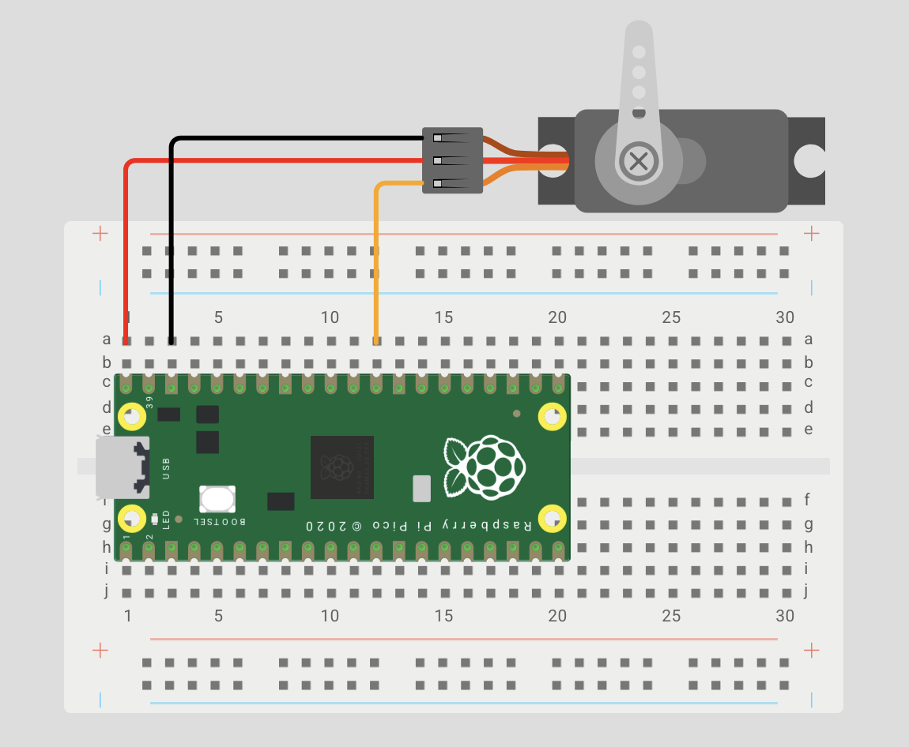

# ⚙️ Pico Servo Driver

A small, efficient, and robust library designed for controlling servos on the RP[2040](https://datasheets.raspberrypi.com/rp2040/rp2040-datasheet.pdf)/[2350](https://datasheets.raspberrypi.com/rp2350/rp2350-datasheet.pdf). It comes with useful features like easing and more, allowing you to easily integrate precise servo control into your projects.

This project was tested on [MG90S](https://towerpro.com.tw/product/mg90s-3/) servos and a [Pico 2 W](https://datasheets.raspberrypi.com/picow/pico-2-w-datasheet.pdf). It should work on all other Pico variants, and most servos. To use the library, simply add `servo.c` and `servo.h` to your project.


## Examples

### Wiring

Here's a simple wiring diagram showing an MG90S servo connected to a Pico using [Wowki](https://wokwi.com/pi-pico). Power is sourced from [VBUS](https://datasheets.raspberrypi.com/pico/Pico-R3-A4-Pinout.pdf) (5V when the Pico is powered via micro-USB), which is typically safe for small servos like the MG90S. However, larger or high-torque servos may exceed the current the Pico can supply, so an external power source is recommended in those cases.



| Example                                                           | Description                                                                               |
| ----------------------------------------------------------------- | ----------------------------------------------------------------------------------------- |
| [basic](./examples/basic.c)                                       | Demonstrates basic servo setup                                                            |
| [callback](./examples/callback.c)                                 | Demonstrates a callback function that gets triggered when servo motion completes          |
| [cancel](./examples/cancel.c)                                     | Shows how to cancel a servo motion mid-way using a cancel flag                            |
| [easing](./examples/easing.c)                                     | Illustrates the use of easing functions to create smooth transitions between servo angles |
| [non_blocking](./examples/non_blocking.c)                         | Demonstrates how to move a servo without blocking the main thread, using interrupts       |
| [sequence](./examples/sequence.c)                                 | Demo of a servo in a sequence of movements                                                |
| [threading/multithreading](./examples/threading/multithreading.c) | Demonstrates how to control servos concurrently using multiple protothreads.              |

### Basic

The [basic example](./examples/basic.c) showing how to configure and control a servo using the Servo struct:

```c
#include "servo.h"

Servo servo = {
    .gpio               = 22u,
    .period_usec        = 20000u,
    .duty_min_usec      = 500u,
    .duty_max_usec      = 2500u,
};

int main()
{
    servo_init(&servo);
    servo_set_deg(&servo, 90.0f);
}
```

### Easing

A key feature of this library is its support for smooth, eased servo motions using interpolation functions (see [easing](./examples/easing.c) and [non_blocking](./examples/non_blocking.c) demos):

```c
// Same setup as above...

#define SEC 1000000u // One second in microseconds

int main()
{
    servo_init(&servo);

    servo_set_deg_ease_wait(&servo, 180.0f, 2 * SEC, ease_in_expo);
    servo_set_deg_ease_wait(&servo, 0.0f, SEC, ease_inverse_smoothstep);
    servo_set_deg_ease_wait(&servo, 180.0f, SEC, ease_inverse_smoothstep);
    servo_set_deg_ease_wait(&servo, 0.0f, 2 * SEC, ease_out_expo);
}
```

### Multiple Servos

As mentioned above, all functions wait until the specified servo is available before starting a new movement. This means you can issue commands to different servos concurrently, and they will begin moving in parallel:

```c
servo_time_to_deg(&servoA, 180.0f, SEC, ease_lin);
servo_time_to_deg(&servoB, 180.0f, SEC, ease_lin);

servo_time_to_deg(&servoA, 0.0f, SEC, ease_lin);
servo_time_to_deg(&servoB, 0.0f, SEC, ease_lin);
```

However, if you issue multiple commands to the same servo, each command will block until the previous one has started, resulting in sequential execution:

```c
servo_time_to_deg(&servoA, 180.0f, SEC, ease_lin);
servo_time_to_deg(&servoA, 0.0f, SEC, ease_lin);

servo_time_to_deg(&servoB, 180.0f, SEC, ease_lin);
servo_time_to_deg(&servoB, 0.0f, SEC, ease_lin);
```

Given this, to cooordinate movements more cleanly, it's often a good idea to control each servo from a dedicated thread or [protothread](https://dunkels.com/adam/pt/), like in the [multithreading example](./examples/threading/multi_threading.c).

## API

To initialize a servo structure, call `servo_init`. Use `servo_deinit` to disable and reset the servo when it's no longer needed.

> [!NOTE]
> Each servo must use a GPIO mapped to a unique [PWM slice](https://datasheets.raspberrypi.com/rp2350/rp2350-datasheet.pdf#%5B%7B%22num%22%3A1077%2C%22gen%22%3A0%7D%2C%7B%22name%22%3A%22XYZ%22%7D%2C115%2C165.63628%2Cnull%5D).
> While the Pico exposes 24 PWM channels, only 12 independent slices are available—thus this library supports up to 12 servos.

All functions wait until the servo is available before initiating a new movement.
However, once the movement begins, the function returns immediately.
If you want the function to block until the movement is fully completed,
use the corresponding `_wait` variant.

> [!WARNING]
> For position control functions, the wait time is estimated using the provided servo speed if [position feedback](https://learn.adafruit.com/analog-feedback-servos/about-servos-and-feedback) is not available. However, the speed of a servo is dependent not only it's formal specification, but the angle delta and torque on the motor. Thus, the waiting functions provide a general estimate on blocking time without position feeback.

| **Control Type** | **Functions**                                | **Description**                                                                              | **Details**                                                                                                                                                             |
| ---------------- | -------------------------------------------- | -------------------------------------------------------------------------------------------- | ----------------------------------------------------------------------------------------------------------------------------------------------------------------------- |
| Position         | `servo_set_deg`<br>`servo_set_rad`           | Move the servo directly to the specified angle.                                              |                                                                                                                                                                         |
| Time             | `servo_time_to_deg`<br>`servo_time_to_rad`   | Move the servo to the specified angle over a set duration, with a specified easing function. | This is implemented with interrupts, and thus runs in the background. The non-wait variants may be canceled. Upon completion, these functions support a callback.       |
| Speed            | `servo_speed_to_deg`<br>`servo_speed_to_rad` | Move the servo to the specified angle at a defined speed.                                    | This is simply a nice wrapper which uses the Time functions under the hood. The non-wait variants may be canceled. Upon completion, these functions support a callback. |

> [!IMPORTANT]
> If you are using PWM IRQs for other purposes, register your IRQ handler after
  initializing all servos and call `servo_on_pwm_wrap()` at the top of your handler (this is untested)

> [!CAUTION]
> Commanding large, fast movements while the servo is under load can also cause wear or breakage. Use easing and/or the `_wait` function variants for safer transitions.

### Easing Functions

The following easing functions are provided for the timed commands (feel free to make your own too!)
These functions map a progress value `x` from `[0.0, 1.0]` to an eased output in `[0.0, 1.0]`.

| **Category** | **Function Name(s)**                      | **Description**                                                    |
| ------------ | ----------------------------------------- | ------------------------------------------------------------------ |
| Linear       | `ease_lin`                                | Constant-speed transition.                                         |
| Sine         | `ease_sin`                                | Smooth sinusoidal acceleration and deceleration.                   |
| Ease In      | `ease_in_quad`, `ease_in_expo`            | Starts slow, then accelerates.                                     |
| Ease Out     | `ease_out_quad`, `ease_out_expo`          | Starts fast, then decelerates.                                     |
| Ease In-Out  | *(combine an In + Out function manually)* | Smooth start and end—custom blend.                                 |
| Bounce       | `ease_in_bounce`, `ease_out_bounce`       | Simulates elastic bounce-in or bounce-out--more fun than practical. |

## TODO

- [ ] Iron out edge case bugs (see FIXMEs)
- [ ] Further testing (see TODOs)
- [ ] Add automated code testing
- [x] Interrupt ease functions
- [ ] Add support for servos with position feedback
- [ ] Test other servos
- [ ] Add easing diagrams to table
- [x] Callback function
- [x] Deinit function